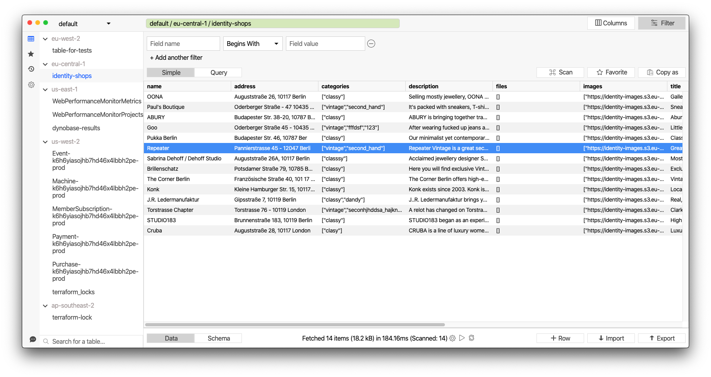

## Dynobase

Modern, flexible and fast DynamoDB editor. Accelerate your workflow with multiple tabs & profiles, faster queries, bookmarks and more. 

## [Download v1.7.0 (macOS / Win / Linux)](https://github.com/Dynobase/dynobase/releases/tag/1.7.0)

or `brew install --cask dynobase` on Mac.

## Features

- Explore datasets with ease and speed. Dynobase offers advanced filtering capabilities, autocomplete attribute names and better performance than AWS console
- Easy navigation between tables on different accounts, profiles and regions
- Visual query builder makes it easy to construct and run scans and queries
- Exporting of all operations into CLI and popular languages SDK formats. No more writing queries; just copy and paste straight into your favorite IDE
- Import and export your data from JSON or CSV files to DynamoDB and the other way around without writing complex scripts
- Bookmarks and history to access you most frequent access patterns and previous queries
- Support for MFA, SSO and credential-process-powered profiles
- DynamoDB Offline/Local support
- PartiQL support - use SQL-like language to query DynamoDB
- Creating / Deleting / Purging DynamoDB tables
- Operation Builder
- Dark Mode

---

- [Homepage](https://dynobase.dev)
- [Releases & Changelog](https://github.com/RafalWilinski/dynobase/releases)

Copyright 2021 Rafal Wilinski
